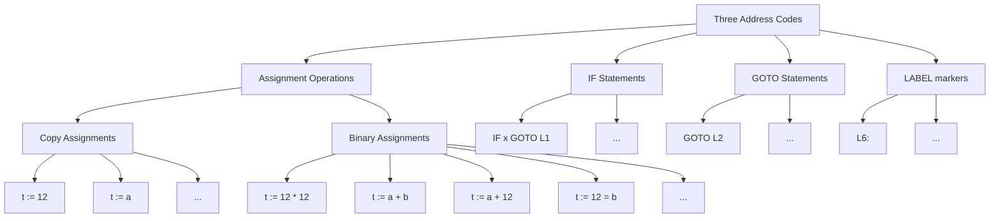

# Compiler4031
K.N Toosi University of Technology Compiler 4031 Fall Project

# Lexer
The lexical analyzer generator `flex` is used to tokenize the input streams into tokens in the project specification format.
A symbol table is contained within the implementation of this lexer, to help with error handling in the future.

# Parser
The Parser is made using `bison` and has the symtab.c integrated in it to manage identifiers upon declarations.
There will be an output file named parser-output.txt that shows the Rules reduced from the input.
The Symbol Table contents can be found in the output.txt file, which also contains the TAC. see below for more info.

# Symbol Table
The Symbol Table is implemented as a hash table using C, and exists in the symboltable/ directory.
Most functions related to symboltable, quadruples and printing them exist in symtab.c
Quadruples are defined as structs in symtab.h, there also a QuadrupleNode struct that is basically a Linked List of Quadruples.
Quadruples are saved as a QuadrupleNode in Symbol Table, hence they are accessible and can be iterated ( in reverse too ) because they are in a Doubly Linked List structure.
The content of the Symbol table along with the Quadruples in the ST are printed in the output.txt produced by parser.

# Intermediate Representation

Intermediate representation will be done in the parser phase of compiler, as a rule is being reduced, we can generate the quadruple for that IR there.
This ofcourse will need access to Symbol Table and good ST management.
Here is a diagram showcasing how the three address codes can be : 


Also we can utilize a system of Linked lists in order to show the relation between the quadruples, here is an example: 

input: 
```
a := 2 + c * 12
```

hence the quadruples are created in order :
```
Three Adress codes         Quadruples
t1 := c * 12        <->   (*, c, 12, t1) -> Binary Assignment
t2 := 12 + t1       <->   (+, 12, t1, t2) -> Binary Assignment
a  := t2            <->   (=, t2, -, a) -> Copy Assignment
```
Now Consider this linked list: 

```
(*, c, 12, t1) -> (+, 12, t1, t2) -> (:=, t2, -, a) -> NULL
```

we can see that the three adress codes can be created seemlessly from this Linked List.
Within our implementation we will be identifying and creating the Quadruples, then placing them in SymbolTable.
The quadruple q can be later be adressed by q.result. doing this means we link them at each step.
In the end, we enumerate the linked lists and then print the corresponding listing of three adress codes.

```
t1 := c * 12 
t2 := 12 + t1     <-> a := 2 + c * 12
a  := t2     
```

The Three Adress Code for an input like below :
```
program test;

integer x, y;
boolean p;
begin
    x := 1;
    y := 1;
    while x < 10 do
        y := y * x;
    
    if (y/3)=2 then
        p := false;

    return true;
end
```

Would be : 
```
    x:=1
    y:=1
    t0 := x < 10
L0:
    IF t0 GOTO L1
    GOTO L2
L1:
    t1 := y * x
    y := t1
    GOTO L0
L2:
    t2 := y / 3
    t3 := t2 = 2
    IF t3 GOTO L3
    GOTO L4
L3:
    p := false
L4:
    RETURN true
```
So Control Flow Exists.
We have THREE ADDRESS CODE GENERATION for assignments, For loops, While loops, If stmts, If-Else stmts...

## Test Cases
Some Programs written using the program specification, to use for Lexer.
they have been written to test the lexer against and can be found in the `lexer/TestCases` directory.

# TODO


- [x] Implement Intermediate Code Generation into parser, translate.y
    - [x] Create a Struct to represent quadruples in symtab.h
    - [x] Create a way to connect quadruples together -> Linked Lists.
    - [x] Everytime a reduction is performed, create and add the corresponding quadruple into Symbol Table.
    - [x] In the end, create a way to move through all the quadruples in order and print them into an output.txt file
- [x] Write Syntax Analyzer Generator in yacc/bison.
- [x] Change and Integrate Symbol Table in parser.
- [x] Write Lexical Analyzer Generator in lex/flex.
- [x] Add Manual Lexer Output for the Lexer to be checked against.
- [x] Add Symbol Table Functionality using hashtable implementation.
- [x] Integrate Symbol Table into lexer.
- [x] Add proper pattern rules to flex program.
