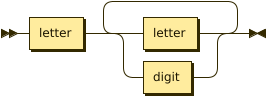
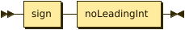
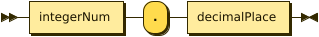

# Language Specification
[BNF](https://www.github.com/xemadp/compiler4031/blob/master/specification/specification.bnf) (Backus-Naur Form), [EBNF](https://www.github.com/xemadp/compiler4031/blob/master/specification/specification.ebnf) for the language provided in the [project declaration](https://www.github.com/xemadp/Compiler4031/blob/master/phase1.pdf).

Here are diagrams for each production in the grammar.

**start:**


```
start    ::= 'program' id ';' decList funcList block
```

**decList:**


```
decList  ::= decs decList*
```

referenced by:

* decList
* funcDec
* parameters
* start

**decs:**


```
decs     ::= type varList ';'
           | ''
```

referenced by:

* decList

**type:**


```
type     ::= 'integer'
           | 'real'
           | 'boolean'
```

referenced by:

* decs
* funcDec

**varList:**


```
varList  ::= id varList*
```

referenced by:

* decs
* varList

**funcList:**


```
funcList ::= funcDec
           | ''
```

referenced by:

* start

**funcDec:**


```
funcDec  ::= 'function' id parameters ':' type decList block
```

referenced by:

* funcList

**parameters:**


```
parameters
         ::= '(' decList ')'
```

referenced by:

* funcDec

**block:**


```
block    ::= 'begin' stmtList 'end'
```

referenced by:

* funcDec
* start
* stmt

**stmtList:**


```
stmtList ::= stmt stmtList*
```

referenced by:

* block
* stmtList

**stmt:**


```
stmt     ::= ( id ':=' | 'return' ) expr ';'
           | ( 'if' expr 'then' ( stmt 'else' )? | ( 'while' | 'for' id ':=' expr 'to' ) expr 'do' ) stmt
           | block
```

referenced by:

* stmt
* stmtList

**expr:**


```
expr     ::= expr ( 'and' | 'or' | '*' | '/' | '+' | '-' | relop ) expr
           | '(' expr ')'
           | integerNumber
           | realNumber
           | 'true'
           | 'false'
           | id ( '(' actualparamlist ')' )?
```

referenced by:

* actualparamlist
* expr
* stmt

**actualparamlist:**


```
actualparamlist
         ::= expr actualparamlist*
           | id
           | ''
```

referenced by:

* actualparamlist
* expr

**relop:**


```
relop    ::= '<'
           | '<='
           | '='
           | '<>'
           | '>='
           | '>'
```

referenced by:

* expr

**id:**



```
id       ::= letter ( letter | digit )+
```

referenced by:

* actualparamlist
* expr
* funcDec
* start
* stmt
* varList

**letter:**


```
letter   ::= 'A'
           | 'B'
           | 'C'
           | 'D'
           | 'E'
           | 'F'
           | 'G'
           | 'H'
           | 'I'
           | 'J'
           | 'K'
           | 'L'
           | 'M'
           | 'N'
           | 'O'
           | 'P'
           | 'Q'
           | 'R'
           | 'S'
           | 'T'
           | 'U'
           | 'V'
           | 'W'
           | 'X'
           | 'Y'
           | 'Z'
           | 'a'
           | 'b'
           | 'c'
           | 'd'
           | 'e'
           | 'f'
           | 'g'
           | 'h'
           | 'i'
           | 'j'
           | 'k'
           | 'l'
           | 'm'
           | 'n'
           | 'o'
           | 'p'
           | 'q'
           | 'r'
           | 's'
           | 't'
           | 'u'
           | 'v'
           | 'w'
           | 'x'
           | 'y'
           | 'z'
```

referenced by:

* id

**nonZeroDigit:**


```
nonZeroDigit
         ::= '1'
           | '2'
           | '3'
           | '4'
           | '5'
           | '6'
           | '7'
           | '8'
           | '9'
```

referenced by:

* digit
* noLeadingInt

**digit:**


```
digit    ::= '0'
           | nonZeroDigit
```

referenced by:

* digitSequence
* id

**integerNum:**



```
integerNum
         ::= sign noLeadingInt
```

referenced by:

* decimalPlace
* realNumber

**sign:**


```
sign     ::= '+'
           | '-'
           | ''
```

referenced by:

* integerNum

**noLeadingInt:**


```
noLeadingInt
         ::= nonZeroDigit digitSequence
```

referenced by:

* integerNum

**digitSequence:**


```
digitSequence
         ::= digit digitSequence*
```

referenced by:

* decimalPlace
* digitSequence
* noLeadingInt

**realNumber:**



```
realNumber
         ::= integerNum '.' decimalPlace
```

referenced by:

* expr

# Lexeme & Token List
[list](https://www.github.com/xemadp/compiler4031/blob/master/specification/token_list.txt) of Lexmes and their corresponding Tokens provided in the [project declaration](https://www.github.com/xemadp/Compiler4031/blob/master/phase1.pdf).

| **LEXEMES**       | **TOKEN_NAME**     |
|--------------------|--------------------|
| `program`         | `PROGRAM_KW`       |
| `function`        | `FUNCTION_KW`      |
| `begin`           | `BEGIN_KW`         |
| `end`             | `END_KW`           |
| `while`           | `WHILE_KW`         |
| `do`              | `DO_KW`            |
| `to`              | `TO_KW`            |
| `if`              | `IF_KW`            |
| `then`            | `THEN_KW`          |
| `else`            | `ELSE_KW`          |
| `integer`         | `INTEGER_KW`       |
| `real`            | `REAL_KW`          |
| `boolean`         | `BOOLEAN_KW`       |
| `return`          | `RETURN_KW`        |
| `and`             | `AND_KW`           |
| `or`              | `OR_KW`            |
| `false`           | `FALSE_KW`         |
| `id`              | `IDENTIFIER`       |
| `integerNumber`   | `INTEGER_NUMBER`   |
| `realNumber`      | `REAL_NUMBER`      |
| `:=`              | `ASSIGN_OP`        |
| `*`               | `MUL_OP`           |
| `/`               | `DIV_OP`           |
| `+`               | `ADD_OP`           |
| `-`               | `SUB_OP`           |
| `<`               | `LT_OP`            |
| `<=`              | `LE_OP`            |
| `<>`              | `NE_OP`            |
| `=`               | `EQ_OP`            |
| `>=`              | `GE_OP`            |
| `>`               | `GT_OP`            |
| `:`               | `COLON`            |
| `;`               | `SEMICOLON`        |
| `,`               | `COMMA`            |
| `(`               | `RIGHT_PA`         |
| `)`               | `LEFT_PA`          |

